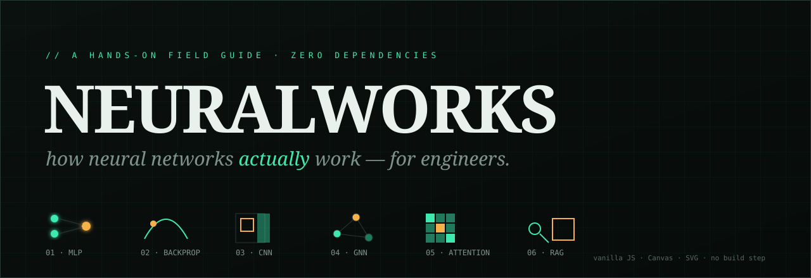

<div align="center">



# NEURALWORKS

**A hands-on, zero-dependency field guide to how neural networks actually work — built for engineers.**

Train a model in your browser. Slide a convolution kernel. Watch a graph gossip. Run a real retrieval pipeline. Every concept is a live, editable visualizer — no frameworks, no hand-waving, no build step.

[](LICENSE)


</div>

---

## Why this exists

Most "intro to neural networks" material is either a wall of equations or a pile of analogies that fall apart the moment you poke them. This project takes a different angle: it assumes you're an **engineer** who already thinks in pipelines, indexes, queues, and feedback loops — and it maps every neural-network concept onto things you already own, then lets you **touch all of them**.

Open it, and you get eight stacked lessons. Each pairs a tight explanation with an interactive panel and an **"SDE LENS"** note connecting the idea to a familiar systems concept.

## What's inside

| # | Module | What it teaches | The visualizer is… |
|---|--------|-----------------|--------------------|
| 00 | **The mental model** | A net is just `f(x; θ)` fit to data; training vs. inference vs. weights | — |
| 01 | **Neurons & networks** | Weighted sum + activation; why non-linearity makes "deep" matter | Activation explorer + a **live MLP trained with real backprop** on two-moons |
| 02 | **How they learn** | Loss surfaces, gradients, backprop, the learning-rate tradeoff | Drop a marble and watch **gradient descent** roll downhill (3 surfaces) |
| 03 | **See it learn · 3D** | The descent in 3D; why initialization & local minima matter | A **continuously-animating 3D loss landscape** — drag to orbit, marble loops forever |
| 04 | **CNNs / vision** | Kernels, feature maps, parameter sharing, translation invariance | A **convolution playground** — draw/erase/upload *your* input, edit the kernel, watch it scan |
| 05 | **GNNs / graphs** | Message passing; k layers = k-hop reach; over-smoothing | An interactive graph — **inject a signal and watch it diffuse** |
| 06 | **Embeddings & attention** | Meaning-as-vector, cosine similarity, query/key/value | An **embedding space** (nearest neighbors) + a **self-attention** map |
| 07 | **RAG** | Index → embed → retrieve top-k → augment → generate | A pipeline running **real cosine-similarity retrieval** over a corpus |
| 08 | **Build your own ⚡** | Compose & train an arbitrary net — visually *or* in code | A from-scratch **model studio**: real N-layer backprop, live loss curve + boundary |
| 09 | **SDE cheat sheet** | ~19 ML terms translated into engineering concepts | A reference table |

## The parts that are genuinely real (not faked)

This isn't a slideshow of pre-rendered results. Three engines do real math in your browser:

- **The MLP trainer** runs actual forward/backward passes and gradient descent. Loss drops from ~0.61 to ~0.03 and the decision boundary bends itself around the data in front of you.
- **The model studio** (§8) is a tiny but complete deep-learning framework: a generalized **N-layer** network with full backprop, trainable on four datasets (XOR, circle, moons, spiral). Verified to reach 99–100% accuracy on all four. Architecture is editable visually *or* as code — the code spec is parsed and validated before instantiating the network.
- **The RAG retriever** builds TF-IDF-weighted term vectors over the corpus and ranks chunks by genuine **cosine similarity** — the same math a vector database runs, just tiny. Every example question retrieves its correct source chunk.

The **3D loss landscape** (§3) is likewise computed frame-by-frame (projection + painter's algorithm, no WebGL), so the descent is real and reacts to your inputs rather than being a recorded clip.

> The only intentional shortcut: RAG's final answer is templated from the top chunk, because a static page can't call an LLM. In production, that step is an API call (e.g. to Claude) with the retrieved context in the prompt — clearly labeled in the UI.

## Quick start

It's a static site with **no dependencies and no build step**.

**Option A — just open it**
```bash
git clone https://github.com/<your-username>/neuralworks.git
cd neuralworks
open index.html        # macOS  (Linux: xdg-open · Windows: start)
```

**Option B — local server** (recommended; avoids any browser file:// quirks)
```bash
npm start              # runs `npx serve .` — no install needed
# or: python3 -m http.server 8000   → http://localhost:8000
```

## Project structure

```
neuralworks/
├── index.html              # markup + section copy; loads the modules below
├── src/
│   ├── styles.css          # the full "instrumentation / oscilloscope" theme
│   ├── main.js             # shared helpers ($, colors) + scroll-spy
│   └── viz/
│       ├── lib-mlp.js           # N-layer net engine + datasets (powers §8)
│       ├── activation.js        # 1a · activation-function explorer
│       ├── mlp.js               # 1b · live MLP trainer (real backprop)
│       ├── gradient-descent.js  # 2  · gradient descent on a loss surface
│       ├── surface3d.js         # 3  · animated 3D loss landscape
│       ├── convolution.js       # 4  · convolution playground (draw / upload)
│       ├── gnn.js               # 5  · graph message passing
│       ├── embeddings.js        # 6a · embedding space
│       ├── attention.js         # 6b · self-attention map
│       ├── rag.js               # 7  · RAG retrieval pipeline
│       └── playground.js        # 8  · build-your-own model studio
├── assets/
│   └── banner.svg
├── LICENSE
└── README.md
```

Each visualizer is a self-contained IIFE that owns its DOM subtree. `main.js` and `lib-mlp.js` load first and define shared globals; the scripts share global scope in load order, so there's no bundler and nothing to configure.

## Design notes

- **Theme:** a dark "instrumentation / oscilloscope" aesthetic — phosphor-teal on near-black, monospace labels, a serif display face — so it reads like a dev tool rather than a generic landing page.
- **Tech:** vanilla JS, the Canvas 2D API for pixel-level visuals (MLP boundary, loss surface, convolution), and inline SVG for the graph. No React, no D3, no build pipeline.
- **Accessibility / responsiveness:** collapses to a single column on narrow screens; the sidebar becomes a horizontal nav.

## Roadmap / ideas

- [ ] A Transformer / LLM section building on §6 (multi-head attention, positional encoding)
- [ ] Wire RAG step ④ to a real model endpoint behind an optional API key
- [x] ~~A build-your-own model playground~~ — shipped in §8
- [ ] Multi-class output + softmax in the model studio
- [ ] Dark/light theme toggle
- [ ] Export the trained model's weights as JSON

Contributions welcome — open an issue or PR.

## License

[MIT](LICENSE) © 2026 Your Name — free to use, learn from, and remix.
